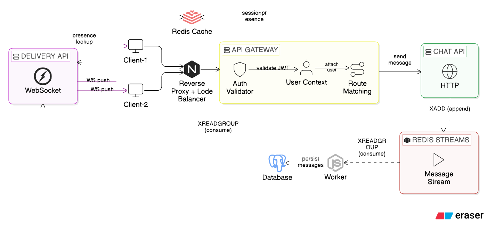

# Collab

Collab is a real-time collaboration platform built as a monorepo with a microservice-style architecture. It enables users to communicate via messaging and video call. Services communicate over HTTP, WebSocket, gRPC, and Redis — each one scoped to a single responsibility.

## Overview

The idea is simple: split the work across focused services so each piece stays small, testable, and independently scalable.

- **Messaging (current)** — Real-time chat with scalable backend architecture.
- **Video Collaboration (coming soon)** — Live video communication features.

- **`web`** — Next.js frontend. Auth, room listing, chat UI.
- **`http-service`** — REST APIs for users and rooms. Also issues short-lived WebSocket tickets.
- **`ws-service`** — Holds WebSocket connections, validates tickets, pushes live updates to clients.
- **`chat-service`** — Handles message operations (create, edit, delete, fetch) and publishes events to Redis.
- **`db-service`** — Exposes gRPC APIs for rooms, users, and messages. Runs a background worker that drains Redis streams into PostgreSQL.

## Architecture

[View on Eraser](https://app.eraser.io/workspace/cXOIjtMxK0rPZQs4jGI3?diagram=KkBkVE9XG1byfMcB-Djx)

## Request Flow (Messaging)

1. Client calls `http-service` to get a short-lived WebSocket ticket.
2. Client connects to `ws-service` using that ticket.
3. Client sends a message through `chat-service`.
4. `chat-service` fetches room/member data from `db-service` over gRPC.
5. `chat-service` publishes the message to Redis Pub/Sub.
6. `ws-service` picks it up and pushes it to connected clients in real time.
7. `db-service` consumes from the Redis stream and persists the message to PostgreSQL.

## Why this structure

Keeping services separate means the WebSocket layer can scale independently from the database layer. Redis handles fast fan-out so `ws-service` never has to know about storage, and `db-service` never has to know about live connections. Each service has one job and one reason to change.
